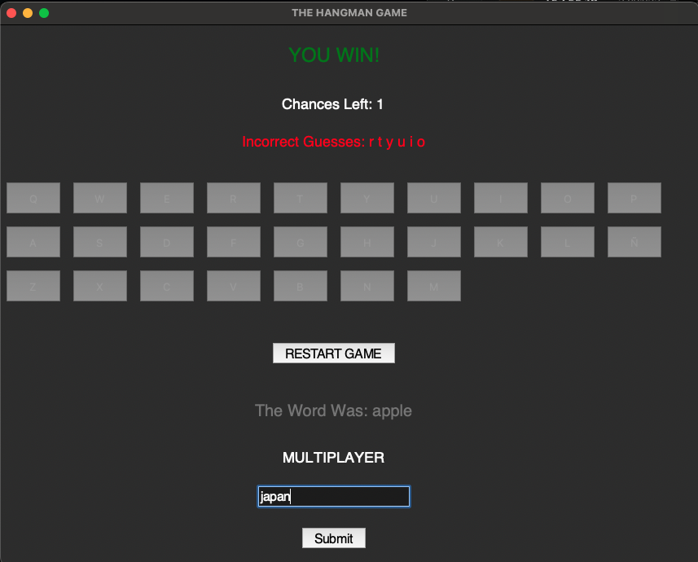
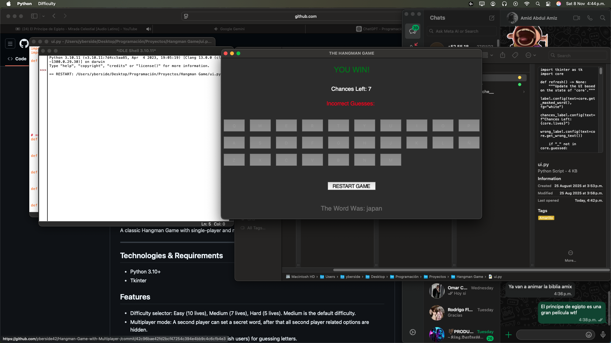
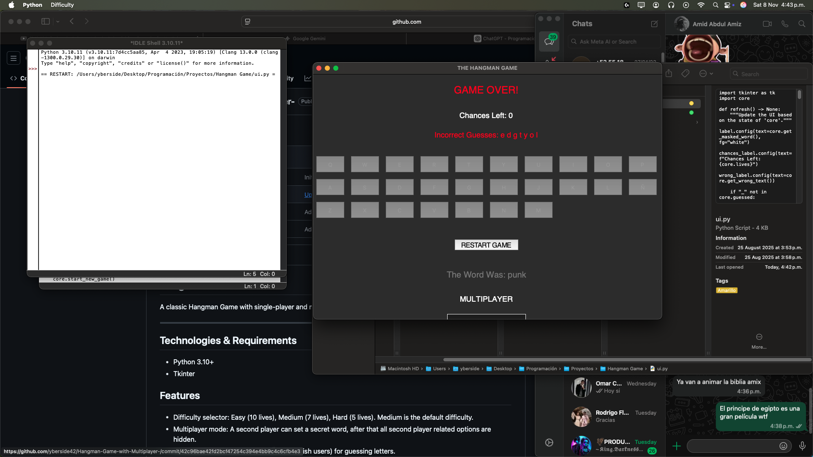
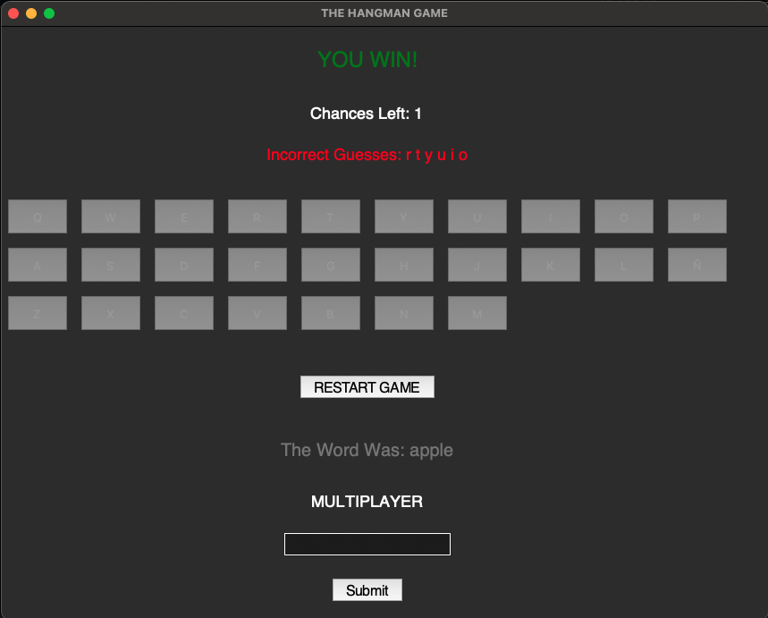

## Hangman Game

A classic Hangman Game with single-player and multiplayer mode, built in Python with Tkinter.


---

## Technologies & Requirements
- Python 3.10+
- Tkinter

## Features
- Difficulty selector: Easy (10 lives), Medium (7 lives), Hard (5 lives). Medium is the default difficulty.
- Multiplayer mode: A second player can set a secret word, after that all second player related options are hidden.




- On-screen Keyboard (Including Ñ for spanish users) for guessing letters.
- Tracks incorrect guesses and remaining lives.
- Restart game button. 
- Victory and Game-Over messages.




## Structure
- core.py: Game logic, difficulties, multiplayer functions and helpers.
- ui.py: Tkinter UI, buttons, menus and layout.

---

## Installation
Make sure you have Python 3.10+ installed and also Tkinter if it's not already installed. Clone the repository into a folder and run 'ui.py' to play.

```bash
python ui.py
```

--- 

## Usage
The default mode of the game is single-player, try to guess the word using the in-game keyboard.

For multiplayer mode: The second player must enter a secret word in their input box, then the first player plays as usual. 

--- 

## What I Learned
- Improved the separation of logic and UI. 
- Learned to use global variables in a multi-file project.
- Learned how to implement logic with conditionals and loops.
- Learned how to use annotations to improve readability.
- Implemented default conditions for game options. 
- Improved handling of UI state changes in Tkinter (e.g., hiding second player options).  
- Improved my debugging skills and bug handling.

---

## License 
This project is licensed under the [MIT License](LICENSE)
© 2025 Yael Tapia.
